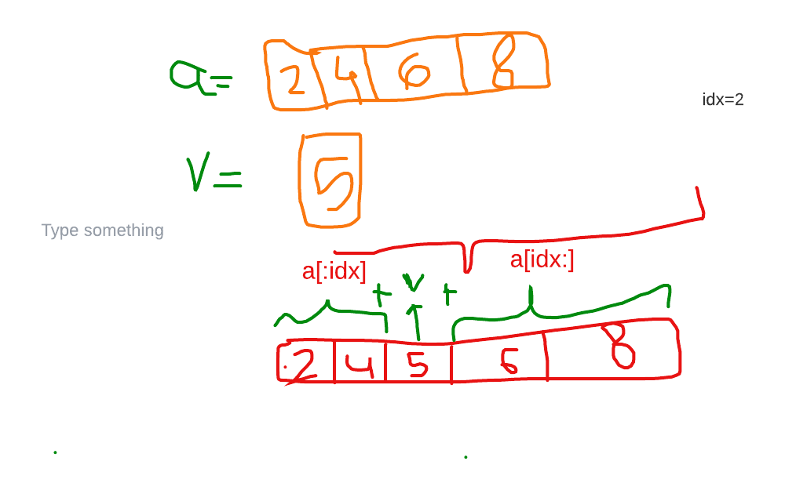
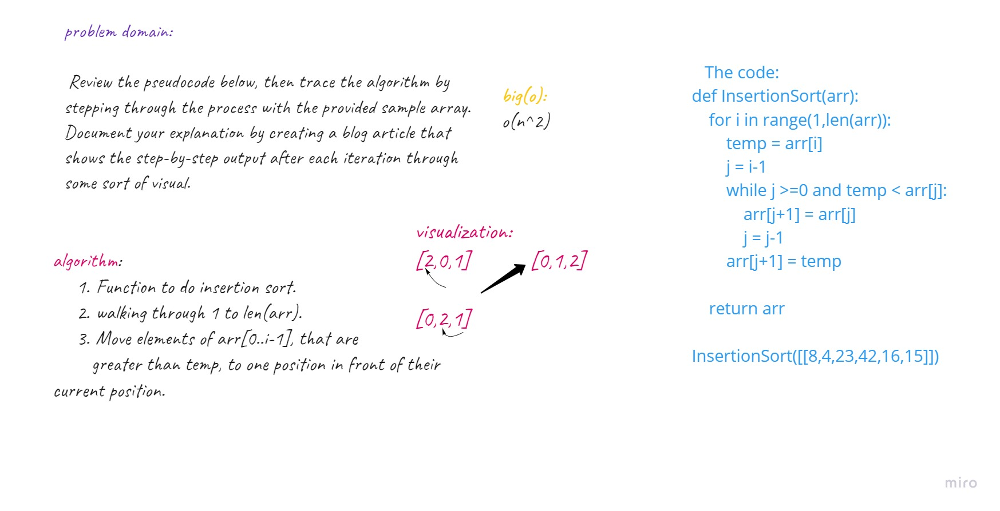
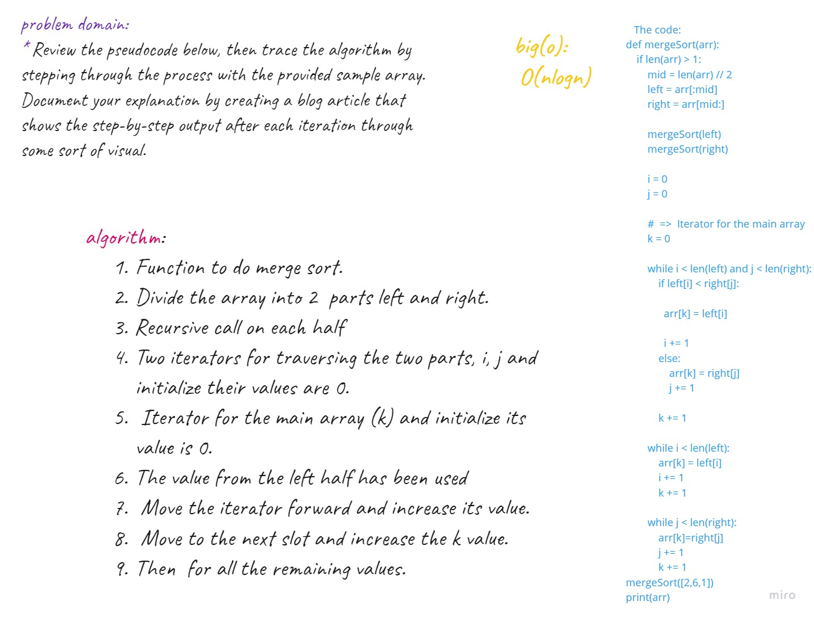
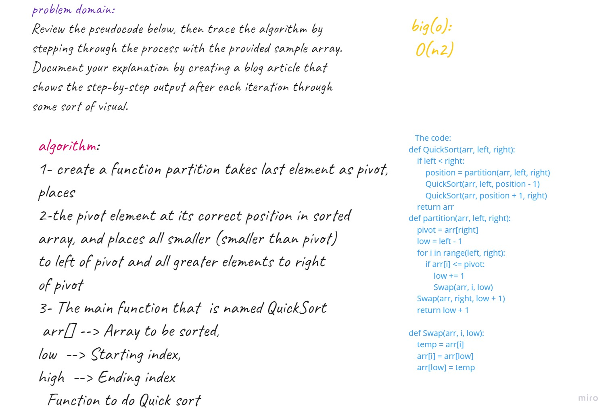
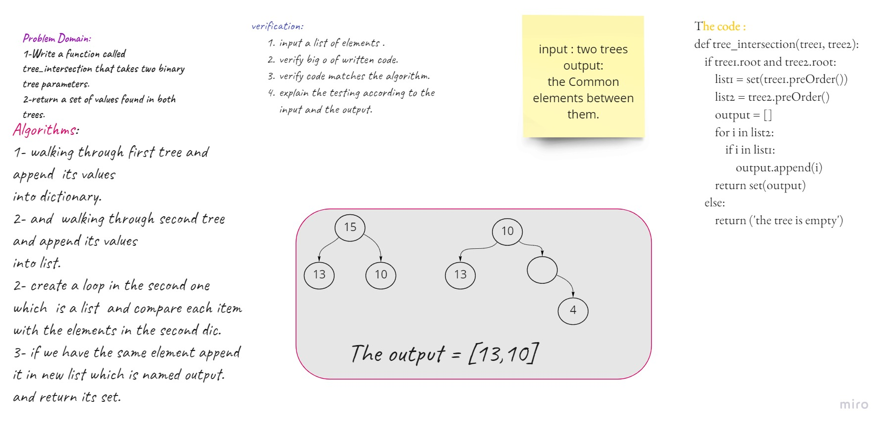

## 1-Reverse an Array
## Challenge
Jut write a function that contains list; we have to arrange the element in reverse way.....

## Approach & Efficiency
I search about it on google and I used the cheatsheet; and it diplayed the method called reverse()

## Solution


## 2-shift 


## 3-First-in, First out Animal Shelter.
## Feature Tasks
* Create a class called AnimalShelter which holds only dogs and cats. The shelter operates using a first-in, first-out approach.
* Implement the following methods:
1- enqueue(animal): adds animal to the shelter. animal can be either a dog or a cat object.
2- dequeue(pref): returns either a dog or a cat. If pref is not "dog" or "cat" then return null.

## 4-Multi-bracket Validation.

* function should take a string as its only argument, and should return a boolean * representing whether or not the brackets in the string are balanced. There are 3 types of brackets:

1. Round Brackets : ()
2. Square Brackets : []
3. Curly Brackets : {}

## 5- Insertion_sort:
### Challenge Summary
* Review the pseudocode below, then trace the algorithm by stepping through the process with the provided sample array. Document your explanation by creating a blog article that shows the step-by-step output after each iteration through some sort of visual.

* tested implementation of Insertion Sort based on the pseudocode provided.
**Pseudocode**
```
  InsertionSort(int[] arr)
  
    FOR i = 1 to arr.length
    
      int j <-- i - 1
      int temp <-- arr[i]
      
      WHILE j >= 0 AND temp < arr[j]
        arr[j + 1] <-- arr[j]
        j <-- j - 1
        
      arr[j + 1] <-- temp
```
### Challenge Description
* Provide a visual step through for each of the sample arrays based on the provided pseudo code
* Convert the pseudo-code into working code in your language
Present a complete set of working tests

### Approach & Efficiency
* Time: O(n^2)
The basic operation of this algorithm is comparison. This will happen n * (n-1) number of times…concluding the algorithm to be n squared.
* Space: O(1)
No additional space is being created. This array is being sorted in place…keeping the space at constant O(1).>

## Solution


## 6- merge_sort:
### Challenge Summary
* Review the pseudocode below, then trace the algorithm by stepping through the process with the provided sample array. Document your explanation by creating a blog article that shows the step-by-step output after each iteration through some sort of visual.

* Once you are done with your article, code a working, tested implementation of Merge Sort based on the pseudocode provided.
**Pseudocode**
```
  
ALGORITHM Mergesort(arr)
    DECLARE n <-- arr.length
           
    if n > 1
      DECLARE mid <-- n/2
      DECLARE left <-- arr[0...mid]
      DECLARE right <-- arr[mid...n]
      // sort the left side
      Mergesort(left)
      // sort the right side
      Mergesort(right)
      // merge the sorted left and right sides together
      Merge(left, right, arr)

ALGORITHM Merge(left, right, arr)
    DECLARE i <-- 0
    DECLARE j <-- 0
    DECLARE k <-- 0

    while i < left.length && j < right.length
        if left[i] <= right[j]
            arr[k] <-- left[i]
            i <-- i + 1
        else
            arr[k] <-- right[j]
            j <-- j + 1
            
        k <-- k + 1

    if i = left.length
       set remaining entries in arr to remaining values in right
    else
       set remaining entries in arr to remaining values in left

```
### Challenge Description
* Provide a visual step through for each of the sample arrays based on the provided pseudo code
Convert the pseudo-code into working code in your language.

* Present a complete set of working tests.

### Approach & Efficiency
* Time: O(nlogn)
Thw worst case the runtime is O(nlogn)
* Space: O(n)
The space complexity of Merge sort is O(n). This means that this algorithm takes a lot of space and may slower down operations for the last data sets.

## Solution



## 7- Quick_sort:
### Challenge Summary
* Review the pseudocode below, then trace the algorithm by stepping through the process with the provided sample array. Document your explanation by creating a blog article that shows the step-by-step output after each iteration through some sort of visual.
**Pseudocode**
```
ALGORITHM QuickSort(arr, left, right)
    if left < right
        // Partition the array by setting the position of the pivot value 
        DEFINE position <-- Partition(arr, left, right)
        // Sort the left
        QuickSort(arr, left, position - 1)
        // Sort the right
        QuickSort(arr, position + 1, right)

ALGORITHM Partition(arr, left, right)
    // set a pivot value as a point of reference
    DEFINE pivot <-- arr[right]
    // create a variable to track the largest index of numbers lower than the defined pivot
    DEFINE low <-- left - 1
    for i <- left to right do
        if arr[i] <= pivot
            low++
            Swap(arr, i, low)

     // place the value of the pivot location in the middle.
     // all numbers smaller than the pivot are on the left, larger on the right. 
     Swap(arr, right, low + 1)
    // return the pivot index point
     return low + 1

ALGORITHM Swap(arr, i, low)
    DEFINE temp;
    temp <-- arr[i]
    arr[i] <-- arr[low]
    arr[low] <-- temp

```
### Challenge Description
* Provide a visual step through for each of the sample arrays based on the provided pseudo code
* Convert the pseudo-code into working code in your language
* Present a complete set of working tests

### Approach & Efficiency
Time-complexity: The worst-case complexity of quicksort is O(n2) as lots of comparisons are needed in the worst condition. Whereas in mergesort, worst-case and average-case have the same complexities O(n log n).

## Solution


## 8- Repeated_word:

### Challenge Description
* Provide a visual step through for each of the sample arrays based on the provided pseudo code
* Convert the pseudo-code into working code in your language
* Present a complete set of working tests

### Approach & Efficiency
Time-complexity:o(n) .

## Solution


## 9- tree-insertion:

### Challenge Description
* Write a function called tree_intersection that takes two binary tree parameters.
* Without utilizing any of the built-in library methods available to your language, return a set of values found in both trees.
### Approach & Efficiency
Time-complexity:o(n) .
space-complexity:o(1) .

## Solution


