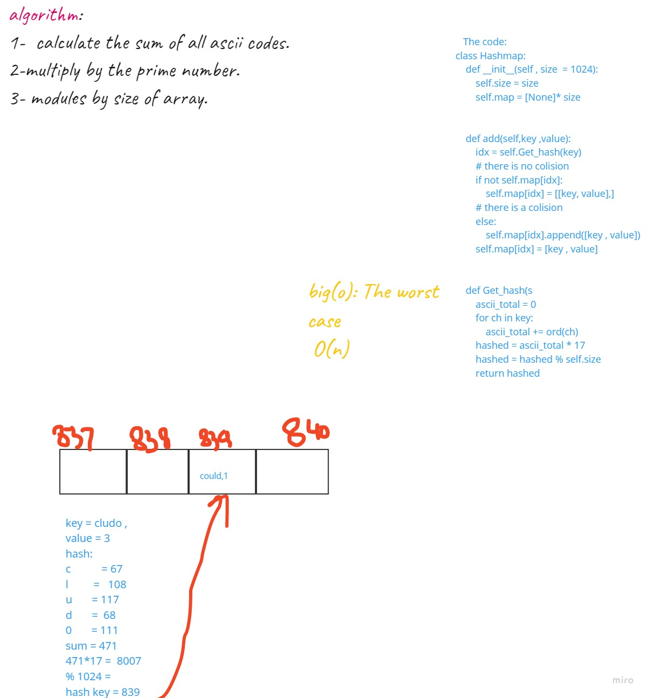

# Hashtables
What is a Hashtable?

* Hash - A hash is the result of some algorithm taking an incoming string and converting it into a value that could be used for either security or some other purpose. In the case of a hashtable, it is used to determine the index of the array.
* Buckets - A bucket is what is contained in each index of the array of the hashtable. Each index is a bucket. An index could potentially contain multiple key/value pairs if a collision occurs.
* Collisions - A collision is what happens when more than one key gets hashed to the same location of the hashtable.
## Hashing
Basically, a hash code turns a key into an integer. It’s very important that hash codes are deterministic: their output is determined only by their input. Hash codes should never have randomness to them. The same key should always produce the same hash code.
## Challenge
### Features
## Implement a Hashtable with the following methods:

* add: takes in both the key and value. This method should hash the key, and add the key and value pair to the table, handling collisions as needed.
* find: takes in the key and returns the value from the table.
contains: takes in the key and returns a boolean, indicating if the key exists in the table already.
* Get_hash: takes in an arbitrary key and returns an index in the collection.

## Approach & Efficiency
Big o is o(1) and the worst case is o(n)

## White board:

