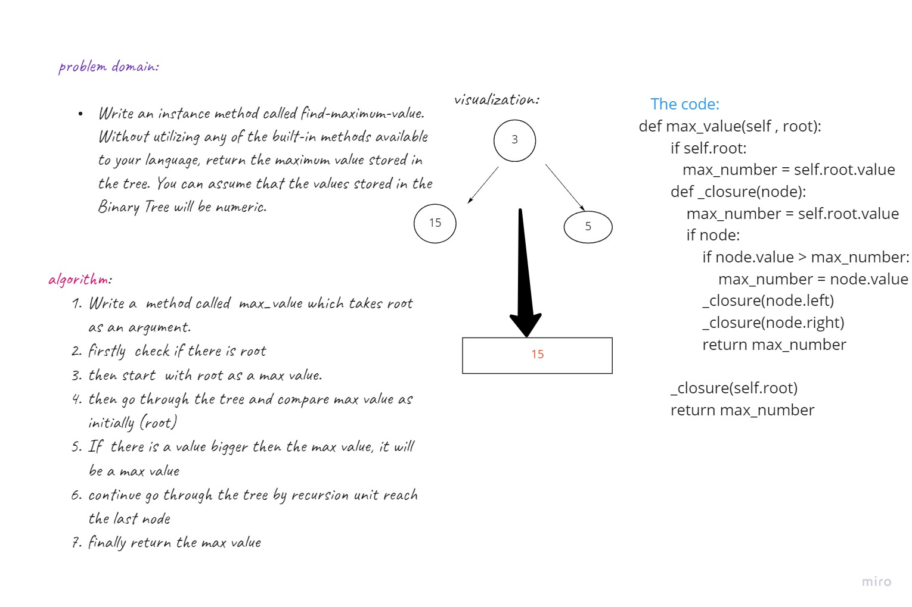

## Tree 

## Pre-order
Let’s break down the pre-order traversal. Here is the pseudocode for this traversal method:
```
ALGORITHM preOrder(root)

  OUTPUT <-- root.value

  if root.left is not NULL
      preOrder(root.left)

  if root.right is not NULL
      preOrder(root.right)
```
## In-order
```
ALGORITHM inOrder(root)
// INPUT <-- root node
// OUTPUT <-- in-order output of tree node's values

    if root.left is not NULL
        inOrder(root.left)

    OUTPUT <-- root.value

    if root.right is not NULL
        inOrder(root.right)
```
## Post-order
```
ALGORITHM postOrder(root)
// INPUT <-- root node
// OUTPUT <-- post-order output of tree node's values

    if root.left is not NULL
        postOrder(root.left)

    if root.right is not NULL
        postOrder(root.right)

    OUTPUT <-- root.value
```
## Binary Search Trees
A Binary Search Tree (BST) is a type of tree that does have some structure attached to it. In a BST, nodes are organized in a manner where all values that are smaller than the root are placed to the left, and all values that are larger than the root are placed to the right. 


# find max value 



